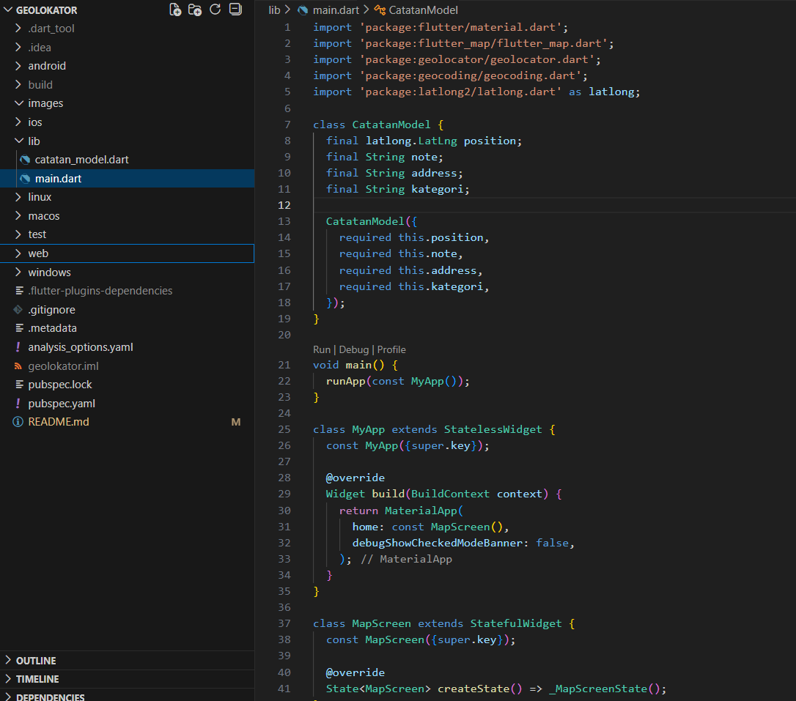
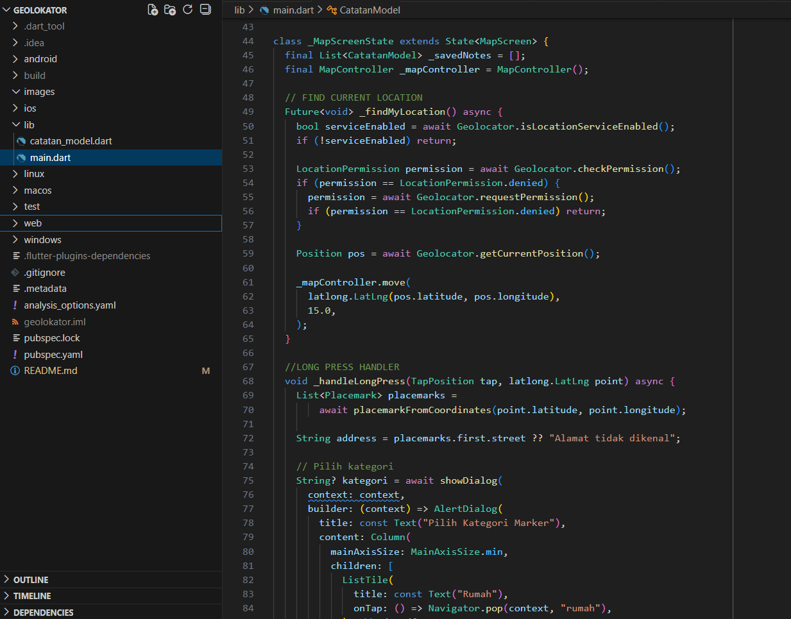
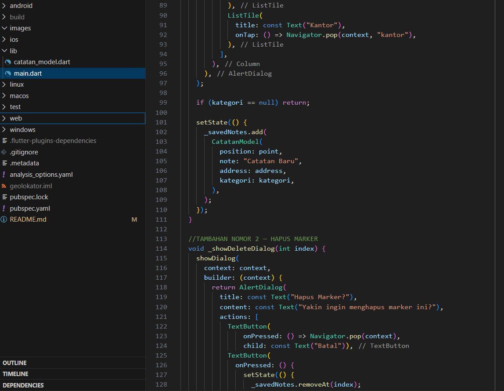
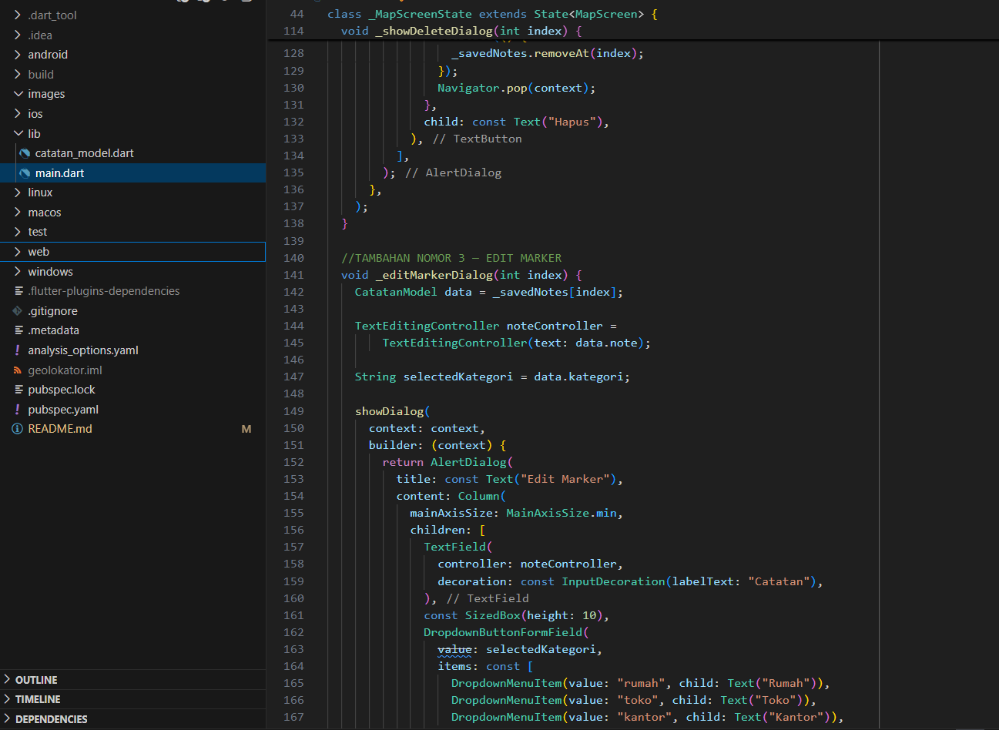
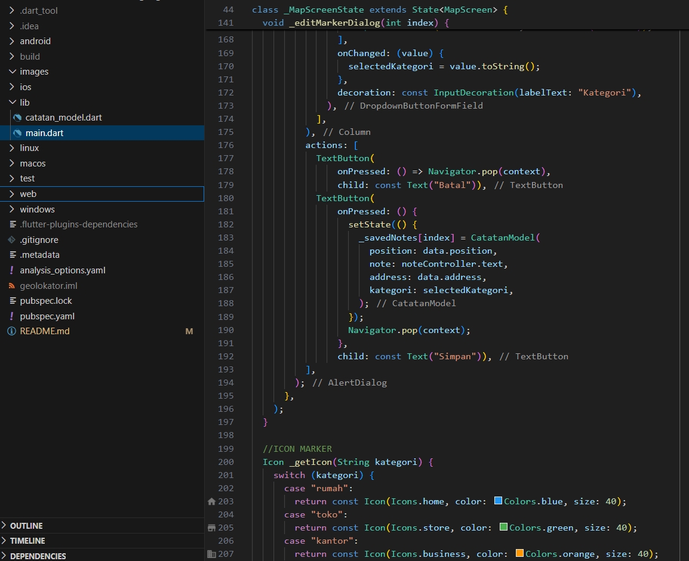
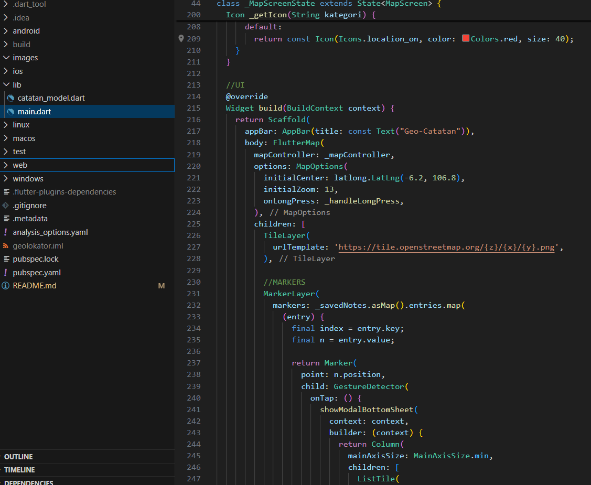
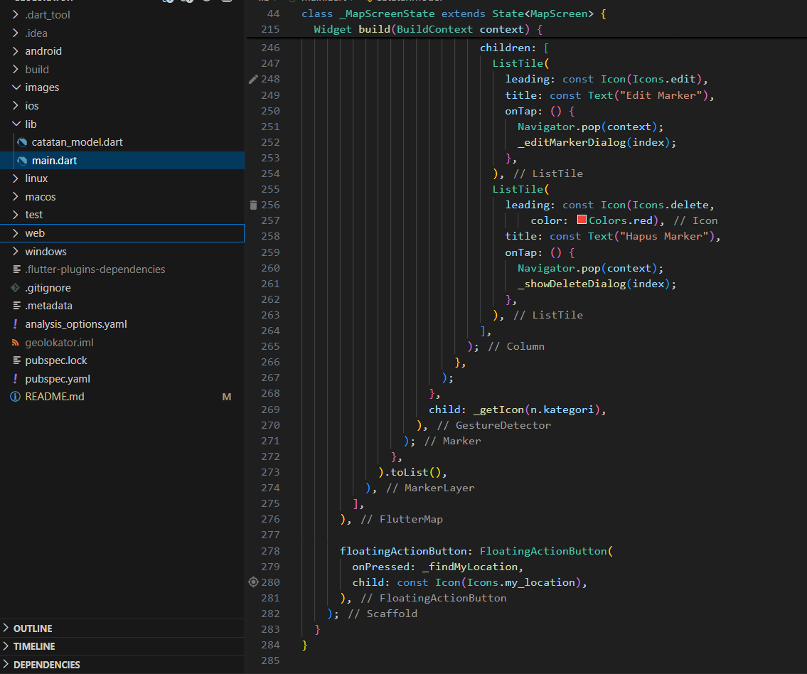

# Geo-Catatan  
### Aplikasi Peta & Geolokasi Flutter

</div>

## Deskripsi  
**Geo-Catatan** adalah aplikasi Flutter yang memungkinkan pengguna menandai lokasi tertentu pada peta melalui *Long Press*, menyimpan catatan lokasi, menentukan kategori marker, menampilkan alamat melalui reverse geocoding, serta mengedit dan menghapus marker.  

Aplikasi ini dibuat sebagai implementasi **Tugas Mandiri** dari praktikum *Mobile Programming – Geolokasi & Peta Digital*.

---

# Fitur Tugas Mandiri

### ✔️ 1. Kustomisasi Marker  
Aplikasi ini menampilkan marker berbeda berdasarkan kategori yang dipilih pengguna:
- Rumah → ikon biru  
- Toko → ikon hijau  
- Kantor → ikon oranye  















Pengguna memilih kategori melalui dialog saat menambahkan marker.

### 2. Menghapus Marker  
Pengguna dapat menghapus marker melalui bottom sheet → dialog konfirmasi → marker terhapus.

### 3. Edit Marker (Fitur tambahan)  
Pengguna dapat:
- Mengedit catatan marker  
- Mengganti kategori marker  

### 4. Reverse Geocoding  
Setiap kali marker ditambahkan, aplikasi otomatis mengambil **alamat** dari GPS koordinat menggunakan `placemarkFromCoordinates`.

### 5. Deteksi Lokasi Pengguna  
Menggunakan Geolocator untuk menemukan posisi GPS dan memindahkan kamera peta.

---

# Penjelasan Kode Program  
Penjelasan kode yang digunakan berdasarkan file `main.dart` dan `catatan_model.dart`.

---

## **1. File: catatan_model.dart**

Model ini digunakan untuk menyimpan data marker dalam bentuk:

```dart
class CatatanModel {
  final LatLng position;   
  final String note;
  final String address;

  CatatanModel({
    required this.position,
    required this.note,
    required this.address,
  });
}


